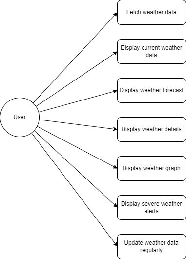
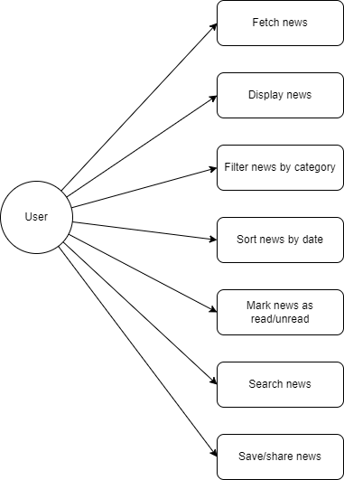
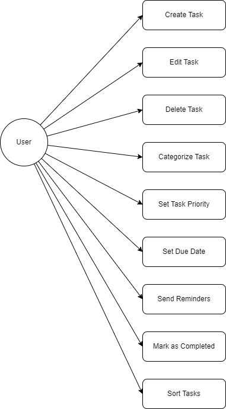
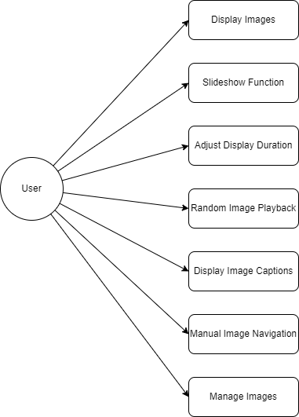
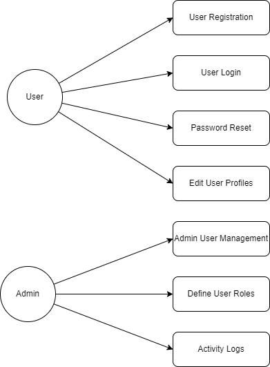

# System Design
Back [to Specification](./TechnicalSpecifications.md)

## 1. Use Case Diagrams

### 1.1 Weather Module

- **Fetch weather data:** The system must fetch weather data from an external API.
- **Display current weather data:** The system must display current weather data.
- **Display weather forecast:** The system must display the weather forecast for the next 7 days.
- **Display weather details:** The system must display temperature, humidity, and wind speed.
- **Display weather graph:** The system must provide a graphical representation of the weather forecast.
- **Display severe weather alerts:** The system must display severe weather alerts.
- **Update weather data regularly:** The system must provide a function to update weather data at regular intervals.

### 1.2 News Module

- **Fetch news:** The system must fetch news from various news sources.
- **Display news:** The system must display the latest news in a list.
- **Filter news by category:** The system must provide a function to filter news by category (e.g., sports, politics, economy).
- **Sort news by date:** The system must allow news to be sorted by date.
- **Mark news as read/unread:** The system must provide a function to mark news as read or unread.
- **Search news:** The system must implement a search function for news.
- **Save/share news:** The system must allow saving or sharing news.

### 1.3 To-Do Module

- **Manage tasks:** The system must allow creating, editing, and deleting tasks.
- **Categorize tasks:** The system must organize tasks into different categories.
- **Set task priorities:** The system must provide a priority function for tasks.
- **Set task due dates:** The system must allow setting due dates for tasks.
- **Send task reminders:** The system must send reminders for upcoming tasks.
- **Mark tasks as completed:** The system must provide a function to mark tasks as completed.
- **Sort tasks:** The system must allow tasks to be sorted by priority and due date.

### 1.4 Digital Frame Module

- **Display images:** The system must display images from various sources (local and online).
- **Slideshow function:** The system must provide a slideshow function for images.
- **Adjust display duration:** The system must allow adjusting the display duration for each image.
- **Random image playback:** The system must provide a function for random playback of images.
- **Display image captions:** The system must display image captions.
- **Manual image navigation:** The system must allow manually navigating through images.
- **Manage images:** The system must provide a function to manage images (add, delete, sort).

### 1.5 User Management Module

- **User registration:** The system must enable user registration and login.
- **User login:** The system must enable user login.
- **Password reset:** The system must provide password reset functions.
- **Edit user profiles:** The system must allow editing user profiles.
- **Admin user management:** The system must provide an admin function to manage users.
- **Define user roles:** The system must allow defining user roles.
- **Activity logs:** The system must maintain activity logs for user actions.

## 2. Sequence Diagrams
### 2.1 Weather Data Fetching

### 2.2 News Fetching

### 2.3 Task Management

## 3. Class Diagrams
### 3.1 Weather Module Classes

### 3.2 News Module Classes

### 3.3 To-Do Module Classes

### 3.4 Digital Frame Module Classes

### 3.5 User Management Module Classes

## 4. Component Diagrams
### 4.1 Overview of Components

## 5. Data Modeling
### 5.1 Entity-Relationship Diagrams (ERD)

### 5.2 Data Flow Diagrams (DFD)

## 6. User Interface and Experience
### 6.1 Mockups and Wireframes

### 6.2 User Flow Diagrams

