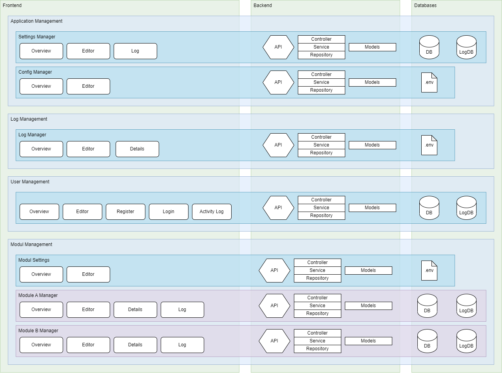

# Technical Specifications

## Overview
The technical specifications document provides a comprehensive overview of the system's architecture, components, and integration points.

- [Component Diagram](docs/Component-Diagram.md)
- [Entity-Relationship Diagram](docs/ER-Diagram.md)
- [Requirement List](docs/RequirementList.md)
- [System Design](docs/SystemDesign.md)

## System Architecture
The system architecture consists of various components and their interactions. The architecture diagrams can be found in the `pic` directory

## Further Details
For detailed component specifications, refer to the component diagram, the entity-relationship diagram, the requirement list, and the system design documents.

# 1. Use Cases
Details in [System Design](docs/SystemDesign.md).

## 1.1 Requirement Specification
Detailed description of the functional and non-functional requirements of the system. Refer to the [Requirement List](docs/RequirementList.md).

## 1.2 Use Case Diagrams
Visualization of the interactions between users and the system. These diagrams illustrate the various ways users can interact with the system and the relationships between user actions and system responses.

# 2. System Design
For more detailed design specifications, refer to [System Design](docs/SystemDesign.md).

## 2.1 Architecture Diagrams
Description of the system's high-level architecture, including the main components and their interactions. These diagrams should clarify the distributed nature of the system, if applicable, and the communication between system components.

## 2.2 Sequence Diagrams
Illustration of the interactions between components for key processes. These diagrams help understand the sequence of operations and how components work together at runtime.

## 2.3 Class Diagrams
Structure of the system in terms of classes, their attributes, operations, and the relationships between classes. Class diagrams provide detailed insight into the software design.

## 2.4 Component Diagrams
Detailed view of the various software and hardware components used in the system and their interactions.

# 3. Data Modeling

## 3.1 Entity-Relationship Diagrams (ERD)
Representation of the data structure and relationships between entities in the system. ERDs are crucial for understanding data persistence and the relational structure of the database.

- Detailed ERD [Entity-Relationship Diagram](docs/ER-Diagram.md)

## 3.2 Data Flow Diagrams (DFD)
Visualization of the flow of data through the system. DFDs show how data moves between processes, data stores, and external entities.

# 4. User Interface and Experience

## 4.1 Mockups and Wireframes
Designs of the user interface and user experience. Mockups and wireframes are essential for visualizing the user interfaces and interaction flows within the application.

## 4.2 User Flow Diagrams
Depiction of the possible paths that users can take through the system. These diagrams help optimize user experience and ensure the user interface is intuitive.

# 5. Technical Specifications

## 5.1 Technology Stack
Description of the technologies used in the project and the rationale for their selection.

### Backend:
- **Go:** High performance, scalability, and efficient parallel processing.
- **PostgreSQL:** Stable, extensible, and strong SQL support.
- **Redis:** In-memory database for fast caching and quick data access.

### Frontend:
- **Quasar (SSR and PWA):** High-quality SPAs, SSR, and PWAs from a single codebase.
- **Pinia:** Lightweight and modular state management for Vue.js.
- **Chart.js:** Interactive and appealing charts.
- **QCalendar:** Calendar functions optimized for Quasar.

### Libraries and Tools:
- **dotenv:** Management of environment variables.
- **lodash:** Utility library for handling and manipulating arrays, objects, and other data types.
- **Snyk:** Security and vulnerability management.
- **Swagger:** API documentation and testing.

## 5.2 System Architecture

### Detailed Description of the System's High-Level Architecture

The system architecture of your application comprises several main components that work together to ensure the functionality and performance of the system. These components are divided into backend and frontend elements, connected through various interfaces and protocols.

### Main Components and Their Interactions

1. **Backend**:
   - **Go**: The primary programming language for backend logic. Go was chosen for its high performance and scalability. It is a compiled language that supports efficient parallel processing.
   - **PostgreSQL**: A relational database used to store persistent data. PostgreSQL provides stable and extensible SQL support, enabling complex queries and transactions.
   - **Redis**: An in-memory database used for fast caching and quick data access. Redis helps improve system response times by keeping frequently used data in memory.

2. **Frontend**:
   - **Quasar Framework**: A framework for developing high-quality Single-Page Applications (SPAs), Server-Side Rendering (SSR), and Progressive Web Apps (PWAs) from a single codebase.
   - **Pinia**: A lightweight and modular state management tool for Vue.js, facilitating the management of application state.
   - **Chart.js**: A library for interactive and appealing charts, used to visualize data on the user interface.
   - **QCalendar**: A calendar library optimized for integration with the Quasar framework, providing calendar functionalities.

3. **Libraries and Tools**:
   - **Dotenv**: For managing environment variables, keeping configuration data secure and separate from the code.
   - **Lodash**: A utility library for handling and manipulating arrays, objects, and other data types.
   - **Snyk**: A tool for security and vulnerability management, helping identify and fix potential security issues in the code.
   - **Swagger**: A suite of open-source tools for API documentation and testing, ensuring clear and understandable API documentation.

4. **Interactions and Data Flow**:
   - **HTTP/HTTPS**: Communication between the frontend and backend occurs over HTTP/HTTPS protocols. RESTful APIs are used to send requests from the frontend to the backend and return responses.
   - **Websockets**: For real-time communication between client and server, e.g., for real-time notifications or live data updates.
   - **Database Queries**: Backend services interact with PostgreSQL and Redis using SQL queries and Redis commands to store and retrieve data.
   - **Caching**: Redis is used to cache frequently accessed data, significantly improving system performance.

### Architecture Diagram

The following diagram illustrates the system architecture, including the main components and their interactions:

This diagram shows how the various components of the system are connected and how data and requests flow through the system. It provides an overview of the structure and key interactions within the system.

## 5.3 Components List
List of all software and hardware components used in the project.

### Software Components:
- **Frontend:** 
  - Quasar Framework
  - Pinia
  - Chart.js
  - QCalendar
- **Backend:**
  - Go
  - PostgreSQL
  - Redis
- **Libraries and Tools:**
  - dotenv
  - lodash
  - Snyk
  - Swagger
- **External APIs:**
  - Weather API
  - News API
  - Email services

### Hardware Components:
- **Server:** 
  - Local development environment (developer PCs)

### Additional Tools:
- **Development Environment:**
  - Visual Studio Code or JetBrains IDEs for development.
  - GitHub for version control and collaboration.
- **CI/CD:**
  - Jenkins or GitHub Actions for CI/CD pipeline.
- **Monitoring and Logging:**
  - Prometheus for system monitoring.
  - ELK Stack for logging and error tracking.

## 5.4 Security Measures

### Authentication
- **Password Hashing**: Using bcrypt for secure storage of passwords.
- **Multi-Factor Authentication (MFA)**: Implementing MFA via OTP (One-Time Passwords).
- **OAuth 2.0**: Integration of OAuth 2.0 for third-party logins.

### Authorization
- **Role-Based Access Control (RBAC)**: Implementing role-based access control.
- **Attribute-Based Access Control (ABAC)**: Using attribute-based access control for more flexible security policies.

### Encryption Techniques
- **TLS**: Using TLS 1.2 or higher to secure communication.
- **AES-256**: Using AES-256 for encrypting data at rest.
- **Key Management**: Secure generation and management of encryption keys using Key Management Services (KMS).

### Security Protocols
- **Data Classification**: Introducing categories for sensitive data.
- **Data Access Policies**: Minimizing access and logging all data accesses.
- **Encryption**: Encrypting sensitive data at rest and during transmission.
- **Compliance and Audits**: Regular security audits and compliance with data protection laws such as GDPR and HIPAA.

## 5.5 Testing Measures

### Unit Testing
- **Go Testing Package**: Using the standard "testing" package for writing unit tests.
- **Testify**: Using Testify for assertions and mocking in Go.

### Integration Testing
- **Go Testing Package**: Using the standard "testing" package for writing integration tests.
- **Ginkgo**: Using Ginkgo for BDD-style integration tests.

### End-to-End Testing
- **Selenium**: Automating browser actions and testing web application workflows.
- **Cypress**: Real-time test execution, comprehensive debugging features, and integrated test runner.

### Test Coverage
- **Codecov**: Tool for measuring code coverage.
- **Coveralls**: Tool for analyzing and reporting test coverage.

### Continuous Integration
- **Jenkins**: Setting up CI/CD pipelines for automated testing and deployment.
- **GitHub Actions**: Integrating CI/CD workflows directly in GitHub repositories.

## 5.6 Database Integration

### InfluxDB Setup
- **Installation**: Install InfluxDB on the designated server or use a managed InfluxDB service.
- **Configuration**: Configure InfluxDB with the necessary settings for retention policies, authentication, and performance tuning.

### PostgreSQL Setup
- **Installation**: Install PostgreSQL on the designated server or use a managed PostgreSQL service.
- **Configuration**: Configure PostgreSQL with appropriate settings for performance and security.
- **Schema Design**: Define relational schemas, tables, and relationships.
- **Indexing**: Implement indexing strategies to optimize query performance.
- **Backup and Recovery**: Set up regular backups and test recovery procedures.
- **Security**: Configure authentication, authorization, and data encryption.

### Redis Setup
- **Installation**: Install Redis on the designated server or use a managed Redis service.
- **Configuration**: Configure Redis with appropriate settings for caching.
- **Cache Strategy**: Define what data will be cached and set expiration policies.
- **Backup and Recovery**: Implement backup procedures for critical cached data.
- **Security**: Enable authentication and secure access to Redis.

## Data Ingestion
- **Telegraf**: Use Telegraf agents to collect log data and system metrics for InfluxDB.
- **Custom Data Collectors**: Implement custom data collectors to ingest weather data into InfluxDB.
- **Application Logic**: Modify application logic to store relational data in PostgreSQL and cache data in Redis.

## Data Schema
- **InfluxDB**:
  - **Tags**: Define tags for categorizing time-series data.
  - **Fields**: Define fields for data details.

- **PostgreSQL**:
  - **Tables**: Define tables for storing relational data.
  - **Columns**: Define columns with appropriate data types and constraints.

- **Redis**:
  - **Keys**: Define keys for accessing cached data.
  - **Values**: Define values to be stored in the cache.

## Querying Data
- **InfluxQL/Flux**: Use InfluxQL or Flux for querying time-series data from InfluxDB.
- **SQL**: Use SQL for querying relational data from PostgreSQL.
- **Redis Commands**: Use Redis commands to retrieve cached data.

## Performance and Maintenance
- **InfluxDB**:
  - **Retention Policies**: Define retention policies to manage data lifespan.
  - **Continuous Queries**: Implement continuous queries for data aggregation.

- **PostgreSQL**:
  - **Indexing**: Implement indexing strategies for optimal performance.
  - **Vacuuming**: Regularly vacuum the database to maintain performance.

- **Redis**:
  - **Cache Expiration**: Set appropriate expiration policies for cached data.
  - **Monitoring**: Monitor cache hit/miss ratios and adjust caching strategies as needed.

## Security
- **InfluxDB**: Enable authentication and encryption for data in transit and at rest.
- **PostgreSQL**: Implement authentication, authorization, and encryption.
- **Redis**: Enable authentication and secure access to Redis.

## Monitoring and Logging
- **InfluxDB**: Use InfluxDB for monitoring time-series data and system metrics.
- **PostgreSQL**: Monitor database performance and log critical events.
- **Redis**: Monitor cache performance and log cache usage statistics.
