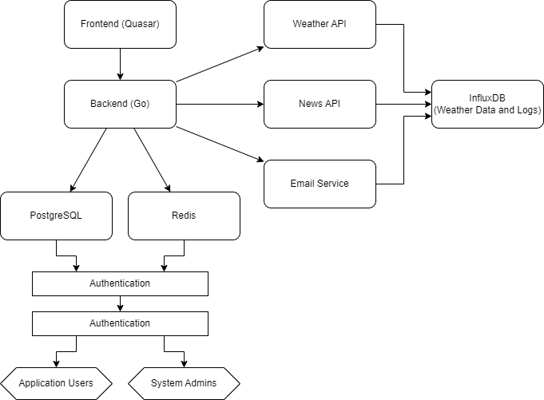

# 1. Use Cases
Back [to README](../README.md)

## 1.1 Requirement Specification
Detailed description of the functional and non-functional requirements of the system. Refer to the [Requirement List](./RequirementList.md).

## 1.2 Use Case Diagrams
[System Design](./SystemDesign.md).

Visualization of the interactions between users and the system. These diagrams illustrate the various ways users can interact with the system and the relationships between user actions and system responses.

# 2. System Design

## 2.1 Architecture Diagrams
Description of the system's high-level architecture, including the main components and their interactions. These diagrams should clarify the distributed nature of the system, if applicable, and the communication between system components.

## 2.2 Sequence Diagrams
Illustration of the interactions between components for key processes. These diagrams help understand the sequence of operations and how components work together at runtime.

## 2.3 Class Diagrams
Structure of the system in terms of classes, their attributes, operations, and the relationships between classes. Class diagrams provide detailed insight into the software design.

## 2.4 Component Diagrams
Detailed view of the various software and hardware components used in the system and their interactions.

# 3. Data Modeling

## 3.1 Entity-Relationship Diagrams (ERD)
Representation of the data structure and relationships between entities in the system. ERDs are crucial for understanding data persistence and the relational structure of the database.

## 3.2 Data Flow Diagrams (DFD)
Visualization of the flow of data through the system. DFDs show how data moves between processes, data stores, and external entities.

# 4. User Interface and Experience

## 4.1 Mockups and Wireframes
Designs of the user interface and user experience. Mockups and wireframes are essential for visualizing the user interfaces and interaction flows within the application.

## 4.2 User Flow Diagrams
Depiction of the possible paths that users can take through the system. These diagrams help optimize user experience and ensure the user interface is intuitive.

 
# 5. Technical Specifications

## 5.1 Technology Stack
Description of the technologies used in the project and the rationale for their selection.

### Backend:
- **Go:** High performance, scalability, and efficient parallel processing.
- **PostgreSQL:** Stable, extensible, and strong SQL support.
- **Redis:** In-memory database for fast caching and quick data access.

### Frontend:
- **Quasar (SSR and PWA):** High-quality SPAs, SSR, and PWAs from a single codebase.
- **Pinia:** Lightweight and modular state management for Vue.js.
- **Chart.js:** Interactive and appealing charts.
- **QCalendar:** Calendar functions optimized for Quasar.

### Libraries and Tools:
- **dotenv:** Management of environment variables.
- **lodash:** Utility library for handling and manipulating arrays, objects, and other data types.

## 5.2 System Architecture
Detailed description of the system's high-level architecture, including the main components and their interactions.

## 5.3 Components List
List of all software and hardware components used in the project.

### Software Components:
- **Frontend:** 
  - Quasar Framework
  - Pinia
  - Chart.js
  - QCalendar
- **Backend:**
  - Go
  - PostgreSQL
  - Redis
- **Libraries and Tools:**
  - dotenv
  - lodash
  - Snyk
  - Swagger
- **External APIs:**
  - Weather API
  - News API
  - Email services

### Hardware Components:
- **Server:** 
  - Cloud-based servers (AWS, Azure) for hosting backend services and databases.
  - Local development environment (developer PCs)

### Additional Tools:
- **Development Environment:**
  - Visual Studio Code or JetBrains IDEs for development.
  - GitHub for version control and collaboration.
- **CI/CD:**
  - Jenkins or GitHub Actions for CI/CD pipeline.
- **Monitoring and Logging:**
  - Prometheus for system monitoring.
  - ELK Stack for logging and error tracking.
