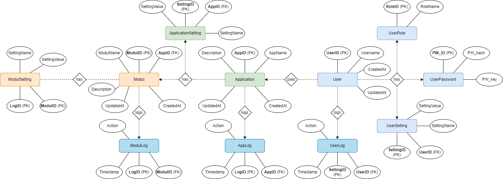

## Entity-Relationship Diagram
For more details on technical specifications and system design, refer to the following documents:
- [Technical Specifications](../TechnicalSpecifications.md)
- [System Design](SystemDesign.md)

## Overview
The ER diagram represents the relationships between different entities in the system. Key entities include:

### User Entities
- **User**: Represents a user in the system.
  - Attributes: UserID, Username, Password, Email, CreatedAt, UpdatedAt
- **UserRole**: Represents the role of a user.
  - Attributes: RoleID, RoleName
- **UserSetting**: Stores user-specific settings.
  - Attributes: SettingID, UserID, SettingName, SettingValue
- **UserLog**: Logs user activities.
  - Attributes: LogID, UserID, Action, Timestamp

### Application Entities
- **Application**: Represents an application within the system.
  - Attributes: AppID, AppName, Description, CreatedAt, UpdatedAt
- **ApplicationSetting**: Stores settings specific to an application.
  - Attributes: SettingID, AppID, SettingName, SettingValue
- **ApplicationLog**: Logs activities related to an application.
  - Attributes: LogID, AppID, Action, Timestamp

### Module Entities
- **Modul**: Represents a module within an application.
  - Attributes: ModulID, AppID, ModulName, Description, CreatedAt, UpdatedAt
- **ModulSetting**: Stores settings specific to a module.
  - Attributes: SettingID, ModulID, SettingName, SettingValue
- **ModulLog**: Logs activities related to a module.
  - Attributes: LogID, ModulID, Action, Timestamp

## Relationships
- **User** `has` **UserRole**
- **User** `has` **UserSetting**
- **User** `has` **UserLog**
- **User** `uses` **Application**
- **Application** `has` **ApplicationSetting**
- **Application** `has` **ApplicationLog**
- **Application** `has` **Modul**
- **Modul** `has` **ModulSetting**
- **Modul** `has` **ModulLog**

The enhanced ER diagram visually represents the relationships between these entities and their respective attributes and relationships.
