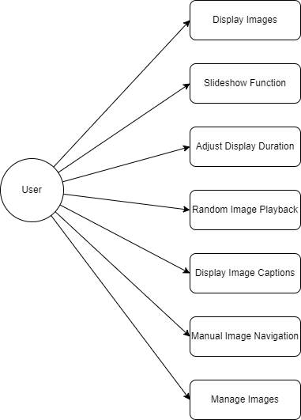

# System Design
For more details on technical specifications, refer to the following documents:
- [Technical Specifications](../TechnicalSpecifications.md)

For more details on specific components, refer to the following documents:
- [Component Diagram](Component-Diagram.md)
- [Entity-Relationship Diagram](ER-Diagram.md)
- [Requirement List](RequirementList.md)

## 1. Use Case Diagrams
Detailed use case diagrams for different modules in the system:

### 1.1 Weather Module
Details can be found in the [Weather Module Use Cases](weather-use-cases.md).

### 1.2 News Module

### 1.3 To-Do Module

### 1.4 Digital Frame Module

### 1.5 User Management Module

## 2. Sequence Diagrams
Sequence diagrams for various processes in the system:

### 2.1 Weather Data Fetching

### 2.2 News Fetching

### 2.3 Task Management

## 3. Class Diagrams
Class diagrams for different modules in the system:

### 3.1 Weather Module Classes

### 3.2 News Module Classes

### 3.3 To-Do Module Classes

### 3.4 Digital Frame Module Classes

### 3.5 User Management Module Classes

## 4. System Architecture
The overall architecture of the system, including major components and their interactions.

### 4.1 Overall Architecture

#### Frontend
- **Framework**: Quasar
- **Responsibilities**: User Interface, interacting with the backend via APIs.

#### Backend
- **Language**: Go
- **Responsibilities**: Business logic, handling API requests, interacting with databases.

#### External Services
- **Weather API**: Provides weather data.
- **News API**: Provides news data.
- **Email Service**: Handles email communications.

#### Databases
- **PostgreSQL**: Stores relational data, such as user information, transactions, etc.
- **Redis**: Used for caching frequently accessed data to enhance performance.
- **InfluxDB**: Stores time-series data, such as logs and weather data.

### 4.2 Data Flow and Integration
The following sections describe the data flow and integration points between the components:

#### Data Flow
- **Frontend to Backend**: The frontend interacts with the backend via RESTful APIs.
- **Backend to Databases**: The backend communicates with PostgreSQL for relational data, Redis for caching, and InfluxDB for time-series data.

#### Integration Points
- **Weather Data**: Collected from the Weather API and stored in InfluxDB.
- **News Data**: Collected from the News API and presented to the frontend.
- **Logs**: Generated by the backend and stored in InfluxDB for monitoring and analysis.
- **Authentication and Authorization**: Managed within the backend, with secure handling of user credentials and permissions.

### 4.3 Security Layer
A security layer ensures that all interactions are authenticated and authorized:
- **Authentication**: Verifies user identity using secure methods.
- **Authorization**: Ensures users have the right permissions to access specific resources.

### 4.4 Security Architecture
Details of the security measures implemented in the system:

#### Authentication and Authorization
- **Password-Based Authentication**: Users log in with a username and password. Passwords are stored using bcrypt.
- **Multi-Factor Authentication (MFA)**: An additional security factor is used.
- **OAuth 2.0**: Allows logins via third-party providers.
- **Role-Based Access Control (RBAC)**: Permissions are based on user roles.
- **Attribute-Based Access Control (ABAC)**: Permissions are based on user attributes and contextual information.

#### Encryption Techniques
- **TLS (Transport Layer Security)**: Ensures secure communication between client and server.
- **AES (Advanced Encryption Standard)**: Symmetric encryption for data at rest.

#### Protocols for Handling Sensitive Data
- **Data Classification and Labeling**: Sensitive data is categorized and labeled accordingly.
- **Data Access Policies**: Access is minimized and all accesses are logged.
- **Data Storage**: All sensitive data is encrypted.
- **Data Transmission**: Secure protocols like HTTPS and SFTP are used.
- **Compliance and Audits**: Regular security audits and compliance with data protection regulations.

### 4.5 Testing Strategy
The testing strategies used in the system:

#### Test Types
- **Unit Tests**: Validate individual functions or methods in isolation.
- **Integration Tests**: Verify the interaction between different modules or components.
- **End-to-End Tests**: Simulate user actions and test the entire system from start to finish.

#### Testing Tools and Frameworks
- **Go**:
  - **Testing Package**: Standard package for writing unit and integration tests in Go.
  - **Testify**: Framework for assertions and mocking in Go.
  - **Ginkgo**: BDD testing framework for Go.
- **JavaScript**:
  - **Jest**: Comprehensive testing framework for JavaScript.
  - **Mocha**: Flexible testing framework for JavaScript.
  - **Selenium**: For end-to-end testing of web applications.
  - **Cypress**: Powerful framework for end-to-end testing of web applications.

#### Test Coverage and Continuous Integration
- **Test Coverage**: Achieve at least 80% coverage for critical components using tools like Codecov and Coveralls.
- **Continuous Integration (CI)**: Implement CI pipelines using Jenkins, GitHub Actions, or Travis CI to automate testing and deployment.

### 4.6 Data Storage and Management
Details on the data storage solutions used in the system:

#### InfluxDB Integration
- **Purpose**: InfluxDB will be used for storing time-series data, such as logs and weather data.
- **Architecture**:
  - **Data Ingestion**: Data will be ingested into InfluxDB using Telegraf or custom data collectors.
  - **Data Storage**: InfluxDB will store log data and weather data, allowing for efficient querying and analysis of time-series data.
  - **Data Querying**: The system will use InfluxQL or Flux to query data from InfluxDB for reporting and analytics.

#### PostgreSQL Integration
- **Purpose**: PostgreSQL will be used for storing relational data that requires ACID compliance and complex querying.
- **Architecture**:
  - **Data Modeling**: Define relational schemas and relationships using SQL.
  - **Data Storage**: Store user data, transactions, and other structured data in PostgreSQL.
  - **Data Querying**: Use SQL for complex queries, joins, and transactions.

#### Redis Integration
- **Purpose**: Redis will be used for caching frequently accessed data to improve application performance.
- **Architecture**:
  - **Cache Strategy**: Identify data that benefits from caching, such as session data, configuration settings, and frequently accessed records.
  - **Data Storage**: Store cached data in Redis with appropriate expiration policies.
  - **Data Retrieval**: Use Redis to quickly retrieve cached data, falling back to the primary database when necessary.

### Data Flow for Databases
1. **Logs and Weather Data (InfluxDB)**:
   - **Collection**: Application logs and weather data are collected and ingested into InfluxDB.
   - **Storage**: Logs and weather data are stored with timestamps and relevant tags.
   - **Querying**: Data is queried for monitoring, analytics, and display purposes.

2. **Relational Data (PostgreSQL)**:
   - **Collection**: User data, transactions, and other structured data are collected and stored in PostgreSQL.
   - **Storage**: Data is stored in relational tables with defined schemas.
   - **Querying**: Data is queried using SQL for reporting and application functionality.

3. **Cached Data (Redis)**:
   - **Collection**: Frequently accessed data is identified and cached in Redis.
   - **Storage**: Cached data is stored with expiration policies to ensure consistency.
   - **Retrieval**: Cached data is retrieved from Redis to enhance performance.

### Database Configuration
Details on the configuration of the databases:

- **PostgreSQL**:
  - **Schema Design**: Define relational schemas and relationships.
  - **Indexing**: Implement indexing strategies to optimize query performance.
  - **Backup and Recovery**: Configure regular backups and test recovery procedures.
  - **Security**: Implement authentication, authorization, and encryption.

- **Redis**:
  - **Cache Management**: Define caching policies and strategies.
  - **Data Expiration**: Set expiration policies for cached data.
  - **Backup and Recovery**: Implement backup procedures for critical cached data.
  - **Security**: Enable authentication and secure access to Redis.
