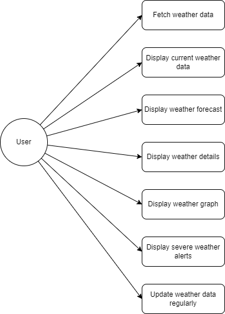

# Weather Module Use Cases
For more details on technical specifications and system design, refer to the following documents:
- [Technical Specifications](../TechnicalSpecifications.md)
- [System Design](SystemDesign.md)

- **Fetch weather data:** The system must fetch weather data from an external API.
- **Display current weather data:** The system must display current weather data.
- **Display weather forecast:** The system must display the weather forecast for the next 7 days.
- **Display weather details:** The system must display temperature, humidity, and wind speed.
- **Display weather graph:** The system must provide a graphical representation of the weather forecast.
- **Display severe weather alerts:** The system must display severe weather alerts.
- **Update weather data regularly:** The system must provide a function to update weather data at regular intervals.
